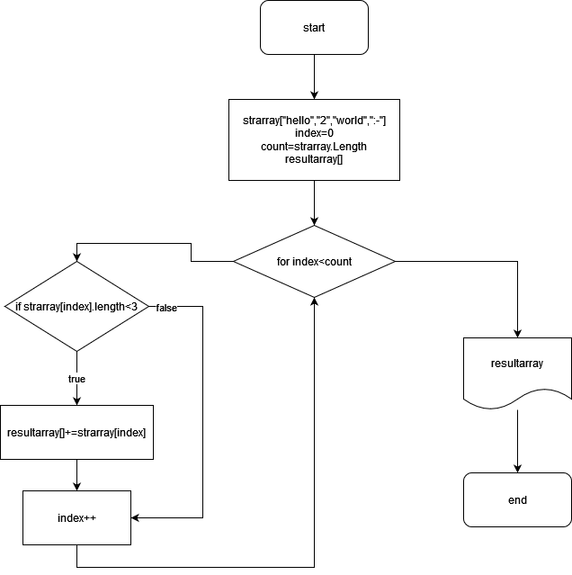

# Проверочная работа

**Задача**: Написать программу, которая из имеющегося массива строк формирует массив строк, меньше или равна 3 символам. Первоночальный массив вводится с клавиатуры или задается на старте.выполнения алгоритма.
## Решение
Для решения нашей задачи я разработал блок схему на основе которой буду писать наше решение:

**Метод void Print1DArry(string[] array)** Этот метод ничего не возвращает. На вход принимает одномерный массив типа *string []*. И сразу его выводит в консоль.

**string [] GetNewArray(string [] arry, int count)** На вход принимает одномерный массив и целое значение типа int длина строки. 
На выходе мы получаем новый одномерный массив в который включены все строки исходного массива с длиной строк не больее Count.

